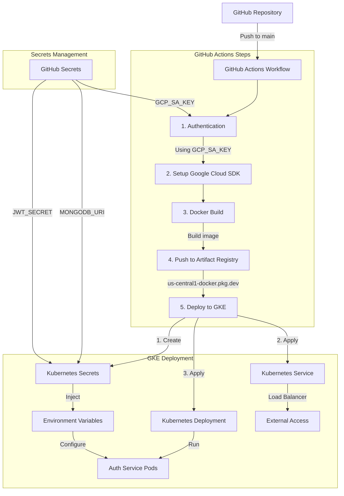

# GitHub Actions to GKE Deployment Tutorial

This tutorial explains how we set up automated deployment from GitHub to Google Kubernetes Engine (GKE) using GitHub Actions.

## Architecture Overview



## Prerequisites

1. Google Cloud Project
2. GitHub Repository
3. Docker
4. kubectl CLI
5. gcloud CLI

## Step-by-Step Setup

### 1. Google Cloud Setup

```bash
# Enable required APIs
gcloud services enable container.googleapis.com containerregistry.googleapis.com artifactregistry.googleapis.com

# Create GKE Autopilot cluster
gcloud container clusters create-auto autopilot-cluster-1 \
  --region=us-central1 \
  --project=template-1743820446385

# Create Artifact Registry repository
gcloud artifacts repositories create docker-registry \
  --repository-format=docker \
  --location=us-central1 \
  --project=template-1743820446385
```

### 2. Service Account Setup

```bash
# Create service account
gcloud iam service-accounts create github-actions \
  --display-name="GitHub Actions Service Account"

# Add necessary roles
gcloud projects add-iam-policy-binding template-1743820446385 \
  --member="serviceAccount:github-actions@template-1743820446385.iam.gserviceaccount.com" \
  --role="roles/container.developer"

gcloud projects add-iam-policy-binding template-1743820446385 \
  --member="serviceAccount:github-actions@template-1743820446385.iam.gserviceaccount.com" \
  --role="roles/storage.admin"

gcloud projects add-iam-policy-binding template-1743820446385 \
  --member="serviceAccount:github-actions@template-1743820446385.iam.gserviceaccount.com" \
  --role="roles/artifactregistry.admin"

gcloud projects add-iam-policy-binding template-1743820446385 \
  --member="serviceAccount:github-actions@template-1743820446385.iam.gserviceaccount.com" \
  --role="roles/iam.serviceAccountTokenCreator"
```

### 3. GitHub Repository Setup

1. Create GitHub Secrets:
   - `GCP_PROJECT_ID`: template-1743820446385
   - `GCP_SA_KEY`: (Service account JSON key)
   - `MONGODB_URI`: Your MongoDB connection string
   - `JWT_SECRET`: Your JWT secret

2. File Structure:
```
.
├── .github/workflows/
│   └── gke-deploy.yml    # GitHub Actions workflow
├── k8s/
│   ├── deployment.yaml   # Kubernetes deployment config
│   └── service.yaml      # Kubernetes service config
└── Dockerfile.service    # Docker build configuration
```

### 4. Kubernetes Configurations

#### Deployment (k8s/deployment.yaml)
```yaml
apiVersion: apps/v1
kind: Deployment
metadata:
  name: auth-service
spec:
  replicas: 1
  selector:
    matchLabels:
      app: auth-service
  template:
    metadata:
      labels:
        app: auth-service
    spec:
      containers:
      - name: auth-service
        image: us-central1-docker.pkg.dev/template-1743820446385/docker-registry/auth-service:latest
        ports:
        - containerPort: 5001
        env:
        - name: NODE_ENV
          value: "production"
        - name: MONGODB_URI
          valueFrom:
            secretKeyRef:
              name: auth-service-secrets
              key: mongodb-uri
        - name: JWT_SECRET
          valueFrom:
            secretKeyRef:
              name: auth-service-secrets
              key: jwt-secret
```

#### Service (k8s/service.yaml)
```yaml
apiVersion: v1
kind: Service
metadata:
  name: auth-service
spec:
  type: LoadBalancer
  ports:
  - port: 80
    targetPort: 5001
  selector:
    app: auth-service
```

### 5. GitHub Actions Workflow

The workflow file (.github/workflows/gke-deploy.yml) defines the CI/CD pipeline:

1. **Trigger**: On push to main branch
2. **Steps**:
   - Authenticate with Google Cloud
   - Set up Cloud SDK
   - Configure Docker
   - Build and push Docker image
   - Deploy to GKE

## Deployment Flow

1. **Code Push**:
   - Developer pushes to main branch

2. **Build Phase**:
   - GitHub Actions triggered
   - Docker image built
   - Image pushed to Artifact Registry

3. **Deploy Phase**:
   - Create Kubernetes secrets
   - Apply service configuration
   - Deploy new version
   - Wait for rollout

4. **Verification**:
   - Check deployment status
   - Verify pod health
   - Confirm service accessibility

## Monitoring and Troubleshooting

1. **GitHub Actions**:
   - Check Actions tab in repository
   - View workflow runs and logs

2. **GKE Dashboard**:
   - Monitor in Google Cloud Console
   - Check workloads and services

3. **kubectl Commands**:
```bash
kubectl get pods
kubectl get services
kubectl get deployments
kubectl describe deployment auth-service
kubectl logs deployment/auth-service
```

## Security Considerations

1. **Secrets Management**:
   - Stored in GitHub Secrets
   - Never committed to repository
   - Injected during deployment

2. **Access Control**:
   - Minimal IAM roles
   - Service account permissions
   - Kubernetes RBAC

3. **Network Security**:
   - Load Balancer configuration
   - Internal service communication
   - Port exposure

## Maintenance

1. **Updates**:
   - Update Docker images
   - Kubernetes configuration changes
   - Secret rotation

2. **Scaling**:
   - Adjust replica count
   - Resource limits
   - Load balancer configuration

3. **Monitoring**:
   - Pod health
   - Service metrics
   - Resource utilization 